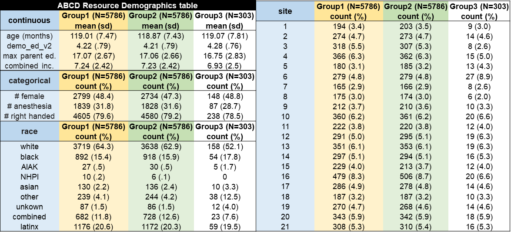
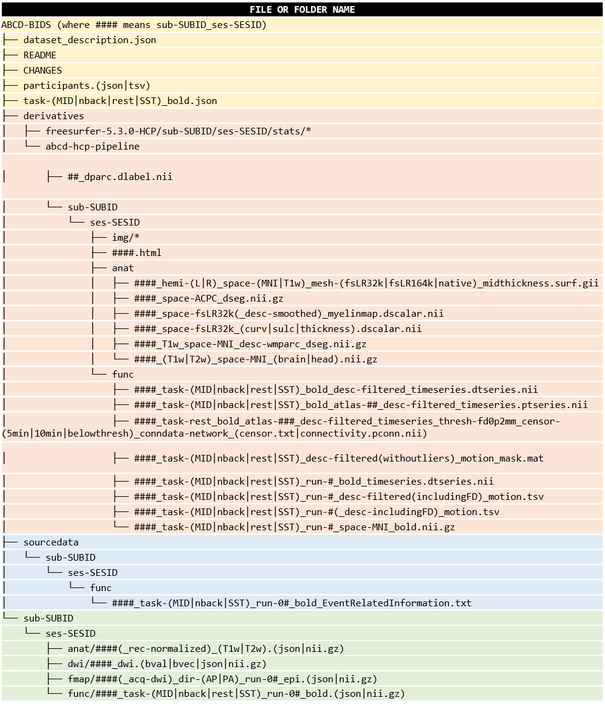

# Recommendations

Note: Clicking any link within the readthedocs site will not open a new web browser tab.  If you want to keep your docs open, either middle-click or right-click and choose open in new tab for the links you would like to follow.

---

## 1. About this Document

This document highlights common recommendations for usage of the collection 3165 data.

## 2. The BIDS Participants Files and Matched Groups

Demographic and socioeconomic variables relating to the ABCD participants included in Collection 3165 can be found in the `participants.tsv` spreadsheet. A data dictionary further explaining each variable is also included. They are available for download on [the main NDA Collection 3165 page](https://nda.nih.gov/edit_collection.html?id=3165). A high level overview of these variables is detailed below.

1. `participant_id`: NDA unique pGUID, starting with `sub-`
1. `session_id`: Participant's session ID (all data within this first release are `ses-baselineYear1Arm1`)
1. `collection_3165`: Presence or absence of the subject from this NDA collection 3165 uploaded data
1. `site`: ABCD site location
1. `scanner_manufacturer`: GE, Philips, or Siemens scanner
1. `scanner_model`: Scanner model name
1. `scanner_software`: Scanner software description
1. `matched_group`: Carefully matched similar groups
1. `sex`: Sex
1. `demo_race_a_p___10`: White
1. `demo_race_a_p___11`: Black/African American
1. `demo_race_a_p___12`: Native American
1. `demo_race_a_p___13`: Alaska Native
1. `demo_race_a_p___14`: Native Hawaiian
1. `demo_race_a_p___15`: Guamanian
1. `demo_race_a_p___16`: Samoan
1. `demo_race_a_p___17`: Other Pacific Islander
1. `demo_race_a_p___18`: Asian Indian
1. `demo_race_a_p___19`: Chinese
1. `demo_race_a_p___20`: Filipino
1. `demo_race_a_p___21`: Japanese
1. `demo_race_a_p___22`: Korean
1. `demo_race_a_p___23`: Vietnamese
1. `demo_race_a_p___24`: Other Asian
1. `demo_ethn_p`: Latinx
1. `demo_race_a_p___25`: Other Race
1. `demo_race_a_p___77`: Refuse To Answer
1. `demo_race_a_p___99`: Don't Know
1. `age`: Age in months
1. `handedness`: Handedness
1. `siblings_twins`: Family member status
1. `income`: Combined income
1. `participant_education`: Participant grade in school
1. `parental_education`: Highest level of parental education
1. `anesthesia_exposure`: History of participant anesthesia exposure
1. `neurocog_pc1.bl`:
1. `neruocog_pc2.bl`:
1. `neurocog_pc3.bl`:
1. `released`: Participants with updated fast track data based on revised QC (see: [known issues](https://collection3165.readthedocs.io/en/stable/release_notes/#released))
1. `updated_dwi_input_json`: Participants scanned on GE with MR Software release DV25.0_R02_1549.b (see: [known issues](https://collection3165.readthedocs.io/en/stable/release_notes/#updated_dwi_input_json))

The `matched_group` field is the product of comparisons across site, age, sex, ethnicity, grade, highest level of parental education, handedness, combined family income, exposure to anesthesia, and family-relatedness which show no significant differences between the ABCD-1 and ABCD-2 groups.  Comparison of the counts and means for each of these factors shows that ABCD-1 and ABCD-2 are negligibly different samples.  Gender shows the largest absolute difference of 2.5 percent.  No other demographic variables differ by more than 1 percent. A further description can be found in the [ABCC paper] (https://doi.org/10.1101/2021.07.09.451638) See table above.

A full-resolution version of this table can be found [here](https://github.com/ABCD-STUDY/nda-abcd-collection-3165/tree/master/docs/img/matched_groups.png).

## 3. The BIDS Quality Control File

This Quality Control (QC) file contains QC metrics for data from this collection and is available for download on [the main NDA Collection 3165 page](https://nda.nih.gov/edit_collection.html?id=3165).  Version 1.0.1 contains brain coverage scores for all runs of the `derivatives.func.runs_task-(MID|nback|rest|SST)_volume` data subsets.  Currently, available fields in the QC file are:

1. `participant_id`: NDA unique pGUID, starting with `sub-`
1. `session_id`: Participant's session ID, starting with `ses-`
1. `data_subset`: Collection 3165 data subset
1. `task`: fMRI task name, starting with `task-`
1. `run`: Chronological run number, starting with `run-`
1. `path`: Relative path from the root of the data set
1. `brain_coverage_score`: Overlap of the functional run time series mean with the atlas mask

### Brain Coverage Score

The brain coverage score is an estimate of how much overlap exists between the fMRI task volumes and the MNI atlas mask.  It is determined by what percentage of the MNI atlas mask file is covered by each temporal mean of the fMRI time series volume.  This is calculated by first taking the temporal mean of the 4-dimensional fMRI time series.  The meaned 3-dimensional volume is then binarized using `fslmaths` and masked using the `MNI152_T1_2mm_brain_mask.nii.gz`.  The brain coverage score is a percentage.  The score is the number of non-zero voxels left in the binarized volume divided by the number of non-zero voxels in the MNI mask.

## 4. Downloading and Unpacking Data

There are two ways to download ABCD Study data and get BIDS inputs or derivatives:

1. (***PREFERRED***) Downloading from NDA Collection 3165 will provide a "data structure manifest" spreadsheet with AWS S3 links and other key information.  DCAN Labs has designed [a GitHub repository for selectively downloading only parts of the BIDS input and derivative data, the "nda-abcd-s3-downloader"](https://github.com/ABCD-STUDY/nda-abcd-s3-downloader).
2. [ABCD Fast Track Data on the NDA](https://nda.nih.gov/abcd/query/abcd-fast-track-data.html) can alternatively be downloaded and unpacked into BIDS with the [ABCD-STUDY abcd-dicom2bids GitHub repository](https://github.com/ABCD-STUDY/abcd-dicom2bids).  This is if you need DICOM files specifically.

### [`nda-abcd-s3-downloader`](https://github.com/ABCD-STUDY/nda-abcd-s3-downloader)

This downloader can parallelize downloads and you can specify only your data subsets of interest.

### [`abcd-dicom2bids`](https://github.com/ABCD-STUDY/abcd-dicom2bids)

This tool pulls DICOMs and E-Prime files from the NDA's "fast-track" data.  It also unpacks, converts, and BIDS-standardizes the fast-track data so it becomes BIDS-compliant and matches that which is uploaded to collection 3165.

## 5. MATLAB Motion Mask Files

In order to make an accurate correlation matrix, use the MATLAB motion mask file described in release document 4, [Derivatives](https://collection3165.readthedocs.io/en/stable/derivatives/), under the **Motion MAT File** heading.

## 6. Interacting with Output Data Types

Along with GIFTIs, released data follows the standards defined by the Human Connectome Project, such as reporting different metrics in standard grayordinate space and saving data using CIFTI standard file formats.

A couple of great blog posts can be read online for more detailed coverage of CIFTI data types and interaction.  These topics will only be briefly discussed in this document.

- [**NIfTI, CIFTI, GIFTI in the HCP and Workbench: a primer** by Jo Etzel from Washington University in St. Louis](http://mvpa.blogspot.com/2014/03/nifti-cifti-gifti-in-hcp-and-workbench.html)
- [**A layman’s guide to working with CIFTI files** by Mandy Mejia from Indiana University](https://mandymejia.com/2015/08/10/a-laymans-guide-to-working-with-cifti-files/)

The following data types, listed by file name extension, are available in this collection's BIDS derivatives.

1. `.dlabel.nii`: "Dense label files" contain the "labels" (a.k.a. parcels) within parcellations.
1. `.dscalar.nii`: "Dense scalar files" contain things like cortical thickness, curvature, and myelin maps on a scalar value per surface vertex basis.
1. `.dtseries.nii`: "Dense time series" contain functional time series from fMRI runs in surface space on a vector time series per surface vertex basis.
1. `.ptseries.nii`: "Parcellated time series," contain the dense time series parcellated by the corresponding dense label file.
1. `.surf.gii`: "GIFTI surface files" contain the "geometry" surface delineations/definitions of a particular surface, like the midthickness surface for example.

### Dense and Parcellated Time Series

The dense and parcellated time series files should regularly be analyzed using their corresponding motion files.  Periods of high motion should be censored out for the purposes of regular connectivity/correlation matrix analysis.

### Correlation Matrices

Correlation matrices should be generated from either the dense or parcellated time series using frame censoring from the aforementioned MATLAB motion mask files.  The [DCAN-Labs/cifti-connectivity tools](https://github.com/DCAN-Labs/cifti-connectivity) should be used which account for choosing a framewise displacement threshold, an acceptable amount of remaining minutes threshold, and outputting either dense (`.dconn.nii`) or parcellated (`.pconn.nii`) connectivity matrices.

### Connectome Workbench

For visualization of all of these CIFTI files, use [Connectome Workbench](https://www.humanconnectome.org/software/connectome-workbench).  

## 7. DCAN Labs Software

We have built tools to utilize this data using our recommended methods.  Read on for descriptions of each publicly-hosted open-source software GitHub repository from [DCAN-Labs](https://github.com/DCAN-Labs).  

### ABCD-BIDS Pipeline: [https://github.com/ABCD-STUDY/abcd-hcp-pipeline](https://github.com/ABCD-STUDY/abcd-hcp-pipeline)

See these release notes' document 3: [**Pipeline**](https://collection3165.readthedocs.io/en/stable/pipeline/).

### Custom Clean: [https://github.com/DCAN-Labs/CustomClean](https://github.com/DCAN-Labs/CustomClean)

Custom clean is a generalized piece of software which is great for defining common output files to delete when presented with similar folders of files.  This is a common occurrence in data processing where you process an input dataset and end up with a similar set of output files for every processed job following some output folder convention.

First you use a graphical user interface (GUI) to teach custom clean about what files should be regularly cleaned.  The custom clean GUI outputs a "cleaning JSON file" which has all the definitions for files to be cleaned within.  After that you can call the custom clean script with the cleaning JSON file as many times as you like on as many similar folders as you like.

### File Mapper: [https://github.com/DCAN-Labs/file-mapper](https://github.com/DCAN-Labs/file-mapper)

File mapper is another generalized piece of software which is great for defining a common output folder/file hierarchy based on a template set of files to be mapped and an output hierarchy to which you can map.  We use it to conform the commonly output "Human Connectome Project-styled" processed folders into BIDS-compliant derivative folders.

Much like custom clean, you define a JSON file which says how to map a file from some common input to some common output in order to "reshape" your data outputs.

## 8. BIDS Folder Layout

Your final BIDS folder structure will look like this tree if you download everything.  Full descriptions of these BIDS input and BIDS derivative data are located in these release notes' documents 2 and 4, [**Inputs**](https://collection3165.readthedocs.io/en/stable/inputs/) and [**Derivatives**](https://collection3165.readthedocs.io/en/stable/derivatives/) respectively.

A full-resolution version of this picture, complete with descriptions, can be found [here](https://github.com/ABCD-STUDY/nda-abcd-collection-3165/tree/master/docs/img/ABCD-BIDS.png).